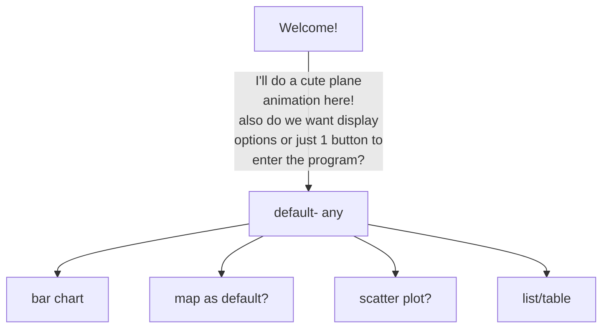

<!-- widgets for data visualization/ query switching rather than home page — maybe these can expand from hover on smaller widget? 
—————————
I think adding features & extra data visualization as we go works for now, especially since our structure is more solid -->
